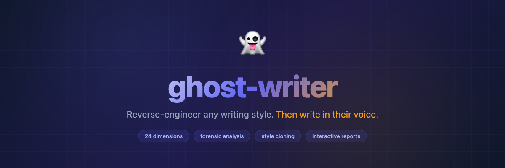
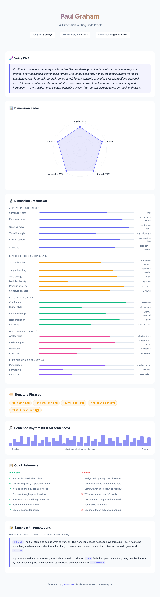

<p align="center">
  
</p>

<h1 align="center">ghost-writer</h1>

<p align="center">
  <strong>Reverse-engineer any author's writing style. Then write in their voice.</strong>
</p>

<p align="center">
  <a href="LICENSE"></a>
  <a href="#install"></a>
  <a href="#compatibility"></a>
</p>

---

Feed ghost-writer 3 blog posts by Paul Graham, and it builds a **24-dimension style profile** — sentence rhythm, vocabulary tier, humor style, rhetorical devices, emotional temperature, and 19 more. Then ask it to write something new. The output reads like Graham wrote it, not like AI imitating Graham.

**Not prompt engineering. Forensic stylometry.**

## What It Does

| | |
|---|---|
| 📥 **Input** | 2–5 writing samples (paste text, file paths, or URLs) |
| 🔬 **Analysis** | 24-dimension forensic style breakdown |
| 📊 **Output** | Interactive HTML report + JSON style profile |
| ✍️ **Writing** | New content that authentically reproduces the voice |

## Before / After

### ❌ Without ghost-writer (default AI)
> In this blog post, we'll explore the fascinating world of startups. Starting a company is a challenging yet rewarding endeavor that requires dedication, perseverance, and a willingness to embrace uncertainty. Let's dive into the key factors that contribute to startup success.

### ✅ With ghost-writer (Paul Graham profile loaded)
> The most dangerous thing about starting a startup is that it's hard in ways you don't expect. Everyone warns you about the long hours. Nobody warns you that the hardest part is making decisions with no information and no one to ask.

## The 24 Dimensions

ghost-writer doesn't just look at "tone." It performs a forensic analysis across 24 independent dimensions, grouped into 5 categories:

```
┌─────────────────────────────────────────────────────────────┐
│                                                             │
│   A. RHYTHM & STRUCTURE          B. WORD CHOICE             │
│   ├─ Sentence length dist.       ├─ Vocabulary tier          │
│   ├─ Paragraph architecture      ├─ Jargon handling          │
│   ├─ Opening moves               ├─ Verb energy              │
│   ├─ Transition style            ├─ Modifier philosophy      │
│   ├─ Closing patterns            ├─ Pronoun strategy          │
│   └─ Structural signature        └─ Signature phrases        │
│                                                             │
│   C. TONE & REGISTER            D. RHETORICAL DEVICES       │
│   ├─ Confidence level            ├─ Analogy & metaphor       │
│   ├─ Humor style                 ├─ Evidence strategy         │
│   ├─ Emotional temperature       ├─ Repetition as device      │
│   ├─ Reader relationship         └─ Question usage            │
│   └─ Formality gradient                                     │
│                                                             │
│   E. MECHANICS & FORMATTING                                 │
│   ├─ Punctuation personality                                │
│   ├─ Formatting habits                                      │
│   └─ Emphasis patterns                                      │
│                                                             │
└─────────────────────────────────────────────────────────────┘
```

## Style Report

The analysis generates an interactive HTML report. Self-contained, dark/light theme, works on mobile.

<p align="center">
  
</p>

Includes:
- **Radar chart** — all dimensions at a glance
- **Rhythm visualization** — sentence length bar chart showing the author's "beat"
- **Signature phrases** — highlighted with frequency counts
- **Voice DNA** — one-paragraph summary of the author's essence
- **Do / Don't cheat sheet** — quick reference for writing in this voice

## Install

### Claude Code

```bash
# Clone into skills directory
git clone https://github.com/OneSpiral/ghost-writer.git ~/.claude/skills/ghost-writer
```

### Claude Code (Marketplace)

```bash
/plugin marketplace add OneSpiral/ghost-writer
```

### Codex CLI

```bash
git clone https://github.com/OneSpiral/ghost-writer.git ~/.codex/skills/ghost-writer
```

### Pi

```bash
git clone https://github.com/OneSpiral/ghost-writer.git ~/.pi/skills/ghost-writer
```

### OpenCode / Any Agent

Copy `SKILL.md` into your agent's skills directory. That's it — it's a single file.

## Usage

### Analyze an author's style

```
> /ghost-writer analyze

Paste 3 Paul Graham essays and I'll build his style profile.
```

Or point to files:

```
> /ghost-writer analyze ~/essays/pg-essay-1.md ~/essays/pg-essay-2.md ~/essays/pg-essay-3.md
```

**Output:**
- `paul-graham-style-profile.json` — machine-readable profile
- `paul-graham-style-report.html` — interactive visual report

### Write in their voice

```
> /ghost-writer write paul-graham

Write a 1000-word essay about why most productivity advice is wrong.
```

The agent loads the style profile and writes as if Paul Graham wrote it — matching his sentence rhythm, vocabulary tier, opening moves, humor placement, and all 24 dimensions.

## How It Works

```
Samples (essays, blog posts, emails)
        │
        ▼
┌──────────────────────┐
│   FORENSIC ANALYSIS  │
│                      │
│   24 dimensions      │
│   measured across    │
│   all samples        │
└──────────┬───────────┘
           │
     ┌─────┴─────┐
     ▼           ▼
  Style       HTML
  Profile     Report
  (.json)     (.html)
     │
     ▼
┌──────────────────────┐
│   VOICE SYNTHESIS    │
│                      │
│   Load profile       │
│   Generate draft     │
│   Self-audit vs      │
│     all 24 dims      │
│   Revise mismatches  │
│   Uncanny valley     │
│     final check      │
└──────────────────────┘
           │
           ▼
    New content in
    the author's voice
```

### Why "24 dimensions" and not just "match the tone"?

Because tone is one dimension out of 24. Two authors can have identical tone (confident, casual) but completely different:
- **Rhythm** — one writes 8-word sentences, the other writes 25-word sentences
- **Openings** — one starts with anecdotes, the other starts with claims
- **Evidence** — one uses data, the other uses personal stories
- **Punctuation** — one loves em dashes, the other uses semicolons

Readers detect these unconscious patterns before they can name them. Miss even 2–3 dimensions and the writing feels "off" even if the tone is right. ghost-writer captures all 24 so nothing slips through.

## Compatibility

| Agent | Status | Install Location |
|-------|--------|-----------------|
| Claude Code | ✅ | `~/.claude/skills/ghost-writer/` |
| Codex CLI | ✅ | `~/.codex/skills/ghost-writer/` |
| Pi | ✅ | `~/.pi/skills/ghost-writer/` |
| OpenCode | ✅ | `~/.opencode/skills/ghost-writer/` |
| Gemini CLI | ✅ | Copy SKILL.md to skills directory |
| Any agent | ✅ | Single SKILL.md file, universal |

## Why Not Just "Write Like X" in Your Prompt?

| Approach | What happens |
|----------|-------------|
| "Write like Paul Graham" | AI produces generic "smart casual tech essay" voice. Misses rhythm, openings, evidence strategy, punctuation habits, emotional arc. |
| ghost-writer | Analyzes actual samples across 24 dimensions. Produces content that would fool someone who reads the author regularly. |

The difference: **generic pattern matching** vs. **forensic style replication**.

## FAQ

**How many samples does it need?**
Minimum 2, ideal 3–5. More samples = more accurate profile, especially for dimensions like "signature phrases" and "sentence length distribution."

**Can I mix sample types?**
Yes. Blog posts + emails + tweets all contribute. The profile captures the author's range, not just one register.

**Does it work for non-English?**
The dimensions are language-universal. Tested primarily on English, but the framework applies to any language.

**Can I edit the style profile?**
Absolutely. The JSON is human-readable. Bump up the humor, dial down the formality, change the vocabulary tier — it's your profile to tune.

## Also By OneSpiral

- **[code-autopsy](https://github.com/OneSpiral/code-autopsy)** — Forensic codebase analysis. 16 diagnostics, health score, complexity heatmap, risk matrix, interactive HTML reports.

## License

MIT — do whatever you want with it.
